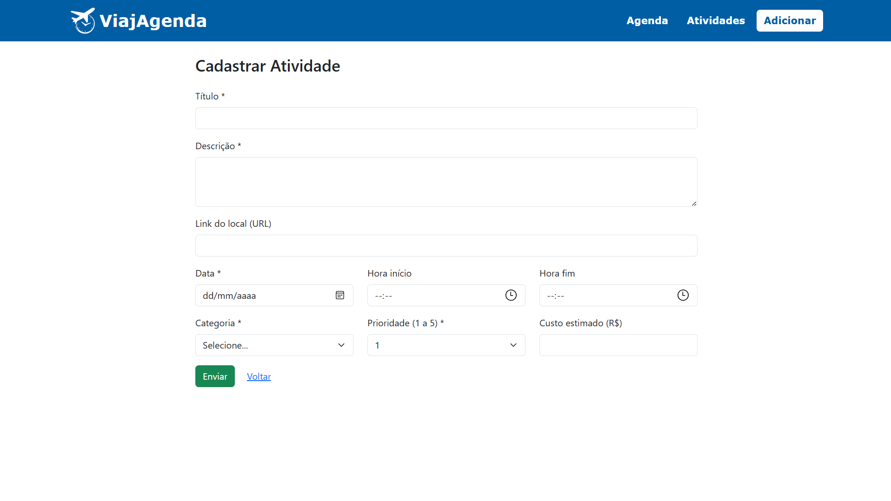
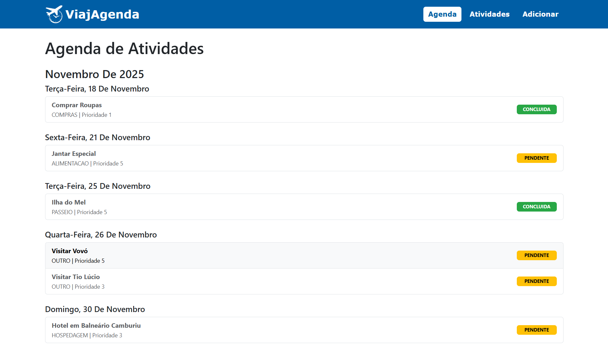
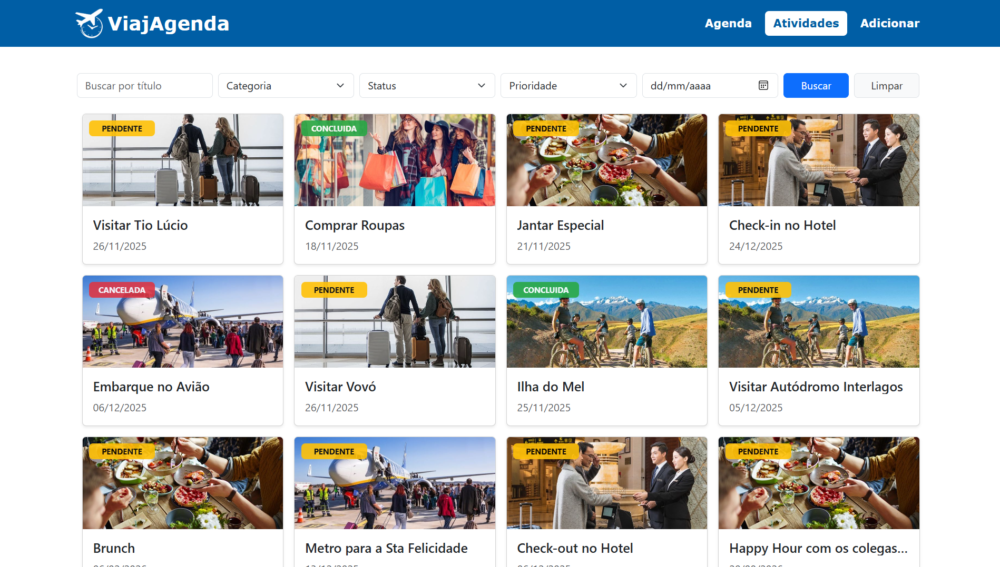

# Desenvolvimento de uma aplicação ReactJS para o cadastro e listagem de informações fornecidas por uma API REST.

## 🧑‍💻Alunos

* Guilherme Daneliv
* Alice Manuela da Silva de Azambuja
* Mateus Augusto Oliveira de Assis

## 🎯Objetivo
O objetivo é desenvolver, do zero, uma aplicação completa que vai funcionar como um cronograma de atividades para se realizar em uma viagem, o Viajagenda. Nele será possível cadastrar diversas atividades a serem realizadas em uma viajem podendo deixar salvas informações importantes como valor do ingresso ou local que acontece. A aplicação possui duas telas de visualização pra essas atividades que foram cadastradas além da tela de cadastro das atividades:

🟣 **Tela de CADASTRO:** Nessa tela existe o formulário de cadastro para as atividades, contendo todos os campos necessários para definir uma nova atividade.

🟣 **Tela AGENDA:** Nesse tela as atividades aparecem listadas como um mini calandário, separadas por dia, para que a pessoa possa ficar ciente de todas as atividades que precisa realizar naquela determindo dia.

🟣 **Tela ATIVIDADES:** Nessa tela terão diversos filtros como: Título, data em que acontece, categoria da atividade, prioridade e status de realização. Com isso, as atividades serão exibidas no formato de card permitindo a filtragem dela com filtros unitários ou combinados.

## 🚀 Tecnologias Utilizadas
* ☕ **Java 17** → Linguagem principal utilizada no desenvolvimento da aplicação.

* 🌱 **Spring Boot 3.5** → Framework que simplifica a criação de APIs REST, oferecendo um ambiente leve e produtivo para aplicações Java.

* 🧩 **Spring Data JPA** → Abstrai o acesso ao banco de dados, permitindo operações CRUD de forma simples com o poder do Hibernate.

* 🐘 **PostgreSQL** → Banco de dados relacional utilizado para armazenar e gerenciar as informações das tarefas.

* ⚙️ **Maven** → Gerenciador de dependências e automação de build, responsável pela configuração e empacotamento do projeto.

* 🧪 **Talend API Tester** → Ferramenta usada para realizar testes das rotas HTTP da API, validando o comportamento e as respostas dos endpoints.

* 🔍 **Jakarta Validation** (Spring Boot Starter Validation) → Biblioteca utilizada para validar os dados de entrada (como descrição obrigatória e prioridade entre 1 e 5).

* ⚛️ **React** → Biblioteca JavaScript utilizada para construção da interface do usuário, garantindo componentes reutilizáveis e uma experiência dinâmica.

* ⚡ **Vite** → Ferramenta de build ultrarrápida utilizada no front-end para desenvolvimento e empacotamento do projeto com React.

* 🎨 **Bootstrap 5** → Framework CSS utilizado para estilização da interface, oferecendo componentes prontos e responsividade.

* 🔗 **Axios** → Cliente HTTP utilizado para realizar requisições à API, facilitando a comunicação entre o front-end e o back-end.

## 📊 Tabela do banco de dados
O banco conta com uma única tabela que serve para guardar cada uma das atividades
| **Coluna**         | **Tipo no Banco**           | **Tamanho / Precisão** | **Validações / Restrições**       | **Descrição**                          |
| ------------------ | --------------------------- | ---------------------- | --------------------------------- | -------------------------------------- |
| **id**             | BIGINT (PK, auto-increment) | —                      | `@Id`, `@GeneratedValue`          | Identificador único da atividade.      |
| **titulo**         | VARCHAR                     | 100                    | `@NotBlank`, `@Size(max=100)`     | Título da atividade.                   |
| **imagem**         | VARCHAR                     | variável               | `@URL`                            | URL da imagem da atividade (opcional). |
| **descricao**      | VARCHAR                     | 500                    | `@NotBlank`, `@Size(max=500)`     | Descrição detalhada da atividade.      |
| **local_url**      | VARCHAR                     | variável               | `@URL`                            | Link do Google Maps (opcional).        |
| **data**           | DATE                        | —                      | `@NotNull`, `@FutureOrPresent`    | Data da atividade.                     |
| **hora_inicio**    | TIME                        | —                      | `@NotNull`                        | Horário de início.                     |
| **hora_fim**       | TIME                        | —                      | `@NotNull`                        | Horário de término.                    |
| **custo_estimado** | NUMERIC                     | precision=10, scale=2  | `@PositiveOrZero`, `@Digits(8,2)` | Custo estimado da atividade.           |
| **categoria**      | VARCHAR                     | 30                     | `@Enumerated(STRING)`, `@NotNull` | Categoria da atividade (enum).         |
| **prioridade**     | INTEGER                     | —                      | `@Min(1)`, `@Max(5)`              | Prioridade de 1 a 5.                   |
| **status**         | VARCHAR                     | 30                     | `@Enumerated(STRING)`, `@NotNull` | Status da atividade (enum).            |

## 📡 Rotas desenvolvidas na API
| **Método** | **Rota**         | **Descrição**                                     | **Corpo / Parâmetros**                                               | **Retornos Possíveis**                                                        |
| ---------- | ---------------- | ------------------------------------------------- | -------------------------------------------------------------------- | ----------------------------------------------------------------------------- |
| **POST**   | `/`              | Cria uma nova atividade.                          | `Atividade` no corpo da requisição.                                  | `201 CREATED` — criada `500 INTERNAL_SERVER_ERROR`                         |
| **GET**    | `/{id}`          | Busca uma atividade pelo ID.                      | `id` (path).                                                         | `200 OK` — retornado `404 NOT_FOUND` `500 INTERNAL_SERVER_ERROR`        |
| **GET**    | `/`              | Lista todas as atividades, com filtros opcionais. | Query params: `titulo`, `categoria`, `status`, `prioridade`, `data`. | `200 OK` — lista `204 NO_CONTENT` `500 INTERNAL_SERVER_ERROR`           |
| **PUT**    | `/{id}`          | Atualiza completamente uma atividade existente.   | `id` (path), `Atividade` no body.                                    | `200 OK` — atualizado `404 NOT_FOUND` `500 INTERNAL_SERVER_ERROR`       |
| **DELETE** | `/{id}`          | Exclui uma atividade pelo ID.                     | `id` (path).                                                         | `204 NO_CONTENT` — removido `404 NOT_FOUND` `500 INTERNAL_SERVER_ERROR` |
| **PATCH**  | `/{id}/concluir` | Marca uma atividade como **CONCLUIDA**.           | `id` (path).                                                         | `200 OK` — atualizado `404 NOT_FOUND` `500 INTERNAL_SERVER_ERROR`       |
| **PATCH**  | `/{id}/cancelar` | Marca uma atividade como **CANCELADA**.           | `id` (path).                                                         | `200 OK` — atualizado `404 NOT_FOUND` `500 INTERNAL_SERVER_ERROR`       |

## 📝Passo a passo da criação do projeto (BACKEND)
* Criação da estrutura base no Springboot Initializr
* Inicialização do projeto no VS Code
* Criação do Banco no PostgreSQL
* Configuração do arquivo applications.proprieties
* Criação do pacote model para definir a classe Atividade.java bem como o mapeamento dela para uma entidade de banco usando as anotações JPA
* Criação do pacote repository e do arquivo AtividadeRepository.java para configurar a interação com o banco usando o JPA
* Criação do pacote control para definir o controlador da aplicação (AtividadeController.java) com todas as rotas solicitadas no trabalho
* Testes iniciais com o Talend API Tester
* Criação do pacote exception para definir o tratamento de erros personalizado (verificação - pontuação extra)
* Alterações no pom.xml para adicionar a dependência do Spring Boot Starter Validation
* Alterações no model e no controller da aplicação para fazer as validações
* Testes finais no Talend API Tester

## 📝Passo a passo da criação do projeto (FRONTEND)
* Criação do protótipo do projeto no Figma
* Criação do esqueleto da tela de cadastro de atividade (AtividadeForm.jsx)
* Criação do esqueleto da tela de agenda (AtividadeAgenda.jsx)
* Criação do esqueleto da tela de atividades com os filtro (AtividadeFiltros.jsx)
* Criação do comonente AtividadeCard.jsx o qual é usado para exibir detalhamendo das atividades nas telas AtividadeAgenda e AtividadeFiltros
* Estilização das telas e dos componentes com o BootStrap e CSS adicional
* Integração com o backend e teste de cadastro e atualização das atividades
